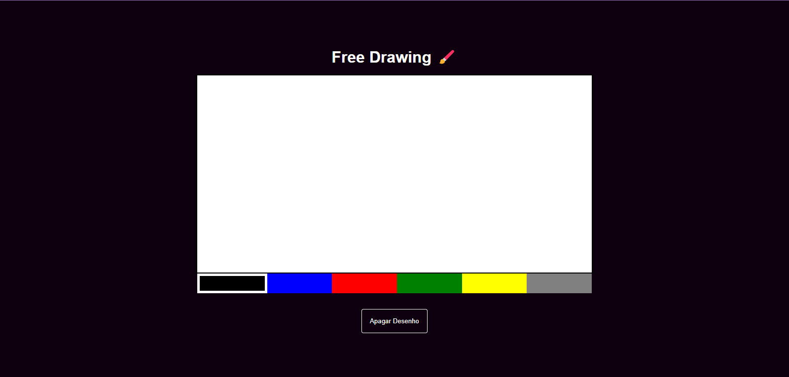
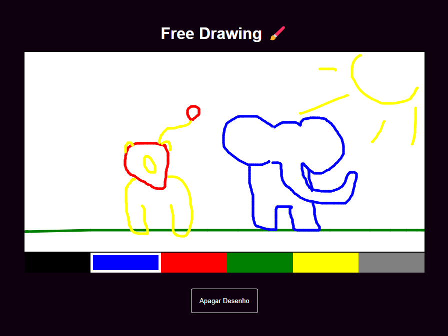

# Free Drawing 🎨



**Free Drawing** é um projeto interativo onde você pode soltar a criatividade e desenhar livremente em uma tela digital. Escolha entre 6 cores disponíveis e crie desenhos personalizados. Se quiser começar de novo, o botão "Apagar Desenho" limpa a tela completamente.

---

## 🎯 Funcionalidades

- Tela interativa para desenho livre.
- Paleta com **6 cores** para personalização.
- Botão "Apagar Desenho" para limpar a tela e recomeçar.

---

## 🖼️ Demonstração

### Visualização com desenho



---

## 🛠️ Tecnologias Utilizadas

- **JavaScript**: Funcionalidade interativa da tela de desenho.
- **CSS**: Estilização do layout.
- **HTML**: Estrutura da aplicação.

---

## 🚀 Como Executar o Projeto

1. Clone o repositório:
   ```bash
   git clone https://github.com/devgabrielsilveira/free-drawing.git

2. Acesse a pasta do projeto:
    cd free-drawing

3. Abra o arquivo index.html no seu navegador.

📌 Aprendizados
Este projeto foi desenvolvido para praticar:

Manipulação do DOM com JavaScript.
Eventos de clique e mouse para interação.
Boas práticas de projeto

## 📬 Contato

Em caso de dúvidas ou sugestões, entre em contato:

- **Email**: devgabrielsilveira@gmail.com
- **LinkedIn**: https://www.linkedin.com/in/gabriel-silveira-67979b18a/

Desenvolvido por Gabriel Silveira 🚀
